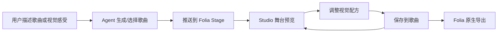

# Studio Mode v2 方案

> 历史设计快照（2026-08-26）。本文保留当时的范围判断；当前需求、实施顺序与验收状态以 [tasks/prd-agent-music-visual-studio.md](../tasks/prd-agent-music-visual-studio.md)、[docs/使用与开发流程.md](使用与开发流程.md) 与 [PROJECT_STATE.md](../PROJECT_STATE.md) 为准。

## 定位

v1 证明“Agent 生成歌曲，Folia 负责渲染与导出”的技术链路成立。v2 的目标不是继续加接口，而是把它们变成一个个人创作产品：用户和 Agent 讨论一首歌，同时看到舞台反应，并能持续调教视觉。

一句话：**Agent 是导演，Folia 是舞台，用户是唯一的制片人和观众。**

## MVP 范围

1. `/studio` 统一工作台
   - 左侧：最近作品与生成状态。
   - 中间：沿用现有 Agent 聊天生成流程。
   - 右侧：Folia web 舞台、推送按钮、视觉配方。

2. 视觉配方成为歌曲数据
   - 三个初始配方：夏夜霓虹、雨窗民谣、Livehouse 现场。
   - 可调维度：能量、色温、高潮氛围。
   - 配方随歌曲保存，刷新后仍生效。
   - 数据库存储字段名为 `visual_recipe`；API 与 UI 序列化字段名为 `visualRecipe`，两者是同一份歌曲配方的存储名和传输名。

3. 第一版可感知渲染
   - 配方通过 Folia web 舞台的 `visualizer` / `cfg` 参数映射到原生视觉模式、主题色、动画强度与背景模式。
   - 不改 Folia 渲染器，不引入新渲染引擎。

> 2026-08-26 已落地：Studio iframe 已从 CSS 滤镜预览切换为 Folia `?obs=1&obsSource=now-playing` 原生舞台 URL。

## 明确不做

- 不做账号、多人协作、云同步和运营后台。
- 不做通用视频剪辑器。
- 不在本期重写 Folia 的 Monet / Cadenza 等渲染器。
- 不把配方伪装成已经影响导出视频的深层渲染；导出链路仍走 Folia 原生能力。

## 交互闭环

## 当时设想的下一阶段

1. Agent 识别“更暗一点”“副歌炸开”“像雨夜车窗”这类反馈，自动改配方。
2. 在真实 Stage 播放会话中目视验证三种配方对 Folia 原生舞台的实际效果。
3. 保存同一首歌的多个视觉版本，支持 A/B 对比和导出。
4. 将最终视觉方案沉淀为可分享的歌卡 / 30 秒视频模板。
